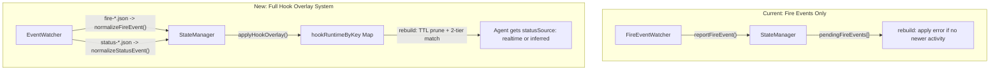

# Hook Overlay System Migration: builders-space to builders-village

## Design Decisions: Hook Setup UX

### How does the user set up hooks?

The user never touches config files or runs shell commands. A **Hook Setup card** in the client UI (`HookSetupCard`, renamed from `FireSetupCard`) presents a one-click "Enable" button. The server exposes three REST endpoints:

- `GET /api/hooks/status` -- returns per-tool status (`configured | available | not_installed`)
- `POST /api/hooks/enable` -- writes hook scripts to `~/.village/hooks/` and registers them in each tool's config
- `POST /api/hooks/disable` -- removes hook entries from configs and deletes scripts

The card auto-hides once dismissed (localStorage key: `village:hook-setup-dismissed`, renamed from `village:fire-setup-dismissed`). The user-facing label is **"Agent Hooks"** -- short, accurate, and not limited to error detection.

**Full rename surface** (all in one phase):

| Location            | Old                                                           | New                                                                            |
| ------------------- | ------------------------------------------------------------- | ------------------------------------------------------------------------------ |
| File                | `client/src/components/FireSetupCard.tsx`                     | `client/src/components/HookSetupCard.tsx`                                      |
| Component           | `FireSetupCard`                                               | `HookSetupCard`                                                                |
| Import in `App.tsx` | `import { FireSetupCard }`                                    | `import { HookSetupCard }`                                                     |
| JSX in `App.tsx`    | `<FireSetupCard />`                                           | `<HookSetupCard />`                                                            |
| localStorage key    | `village:fire-setup-dismissed`                                | `village:hook-setup-dismissed`                                                 |
| UI heading          | `"Fire Alerts"`                                               | `"Agent Hooks"`                                                                |
| Button label        | `"Enable Fire Alerts"`                                        | `"Enable Agent Hooks"`                                                         |
| Description text    | `"Buildings catch fire when agent sessions end with errors."` | `"Get real-time agent status updates and error detection for your buildings."` |
| README section      | `"## Fire Alerts Setup"`                                      | `"## Agent Hooks Setup"`                                                       |
| FAQ Q5 reference    | `"see 'Enable Fire Alerts' in the UI"`                        | `"see 'Enable Agent Hooks' in the UI"`                                         |
| README architecture | `FireSetupCard (hook opt-in UI)`                              | `HookSetupCard (hook opt-in UI)`                                               |

### What if a user does NOT set up hooks?

**Everything works exactly as it does today.** The hook overlay system is purely additive:

- No hooks enabled means no event files are ever written to `~/.village/events/`
- The `EventWatcher` watches the directory but receives nothing -- it's a no-op
- The `hookRuntimeByKey` map stays empty
- During `rebuild()`, every agent gets `statusSource: 'inferred'` -- identical to current behavior
- The `statusSource` field on `Agent` is optional; the frontend never reads it (it only checks `agent.status`)
- Fire detection also stops working without hooks (same as today)

In short: without hooks, builders-village behaves exactly as it does before this migration. Hooks are a transparent upgrade layer.

### How does hook setup avoid interfering with other hooks?

This is the most important safety concern. The builders-space approach (which we port) uses **additive array merging** rather than replacement:

1. **Array append, not replace**: All three tools (Claude, Cursor, Codex) store hooks as arrays of entries per event. The enable code pushes new entries onto existing arrays -- it never overwrites. Other tools' hooks survive untouched.
2. **Idempotent check**: Before appending, the code checks if `status-hook.sh` or `fire-hook.sh` is already present in the config content. If so, it's a no-op. Running "enable" twice is safe.
3. **Backup before modify**: `backupFile()` copies the original config to `~/.village/backups/<timestamp>_<tool>-config.*` before any write. If something goes wrong, the user can restore manually.
4. **Clean removal**: `disableHooks()` filters arrays to remove only entries whose `command` includes `fire-hook.sh` or `status-hook.sh`. All other entries are preserved. If an array becomes empty, the key is deleted. If the hooks object becomes empty, it's deleted. The config file structure is otherwise untouched.
5. **Side-effect-free scripts**: The shell scripts only write a JSON file to `~/.village/events/` and `exit 0`. They don't modify stdin/stdout, don't block, and always exit 0 so they cannot break other hooks in the chain.
6. **Future-proof**: If a user later adds hooks from another app, our entries are just additional array elements. The other app's enable logic will see our entries but won't know or care about them -- they're just opaque entries in the same array.

---

## What Changes

Replace the current **fire-event-only** error channel with the full **hook overlay system** from builders-space. This gives builders-village real-time status authority from agent hooks (SessionStart, PostToolUse, Stop, SessionEnd) instead of relying solely on filesystem heuristics. The overlay system uses TTL-based expiry and two-tier matching (sessionId, then cwd) to override inferred status when real-time data is available.

## Architecture Change

## Files Changed

### Phase 1: Tests First

**1a. `server/src/__tests__/stateManager.test.ts`** (rewrite)

- Ported all 17 test cases from builders-space stateManager.test.ts
- Adapted to village types: `Agent` (not `AgentInfo`), `Project` (not `ProjectInfo`), include `gridPosition`
- Added `sessionId` field to `makeAgent` helper (new field on `Agent`)
- Test scenarios: no overlays (all inferred), Claude/Codex/Cursor realtime overlay, watcher update during trust window, clearHookRuntimeForSources, TTL boundary expiry (non-terminal at 10 min, terminal at 1 hour), pre-discovery overlay, multi-agent independent matching, rapid events, empty sessionId+cwd fallback, deletion edge cases
- Preserved the 6 existing tests (merge, dedupe, normalize paths, grid positions, change event, removal)

**1b. `server/src/__tests__/eventWatcher.test.ts`** (new file)

- Ported all 30+ test cases from builders-space eventWatcher.test.ts
- Tests cover: `normalizeStatusEvent` (SessionStart/PostToolUse/Stop/SessionEnd with all variants), `normalizeFireEvent`, `detectSource`, `extractSessionId`, `extractCwd`, Cursor camelCase lifecycle, mode assignment, unknown events

### Phase 2: Shared Types

**File: `shared/types.ts`**

- Added `AgentStatusSource` type: `export type AgentStatusSource = 'realtime' | 'inferred';`
- Added `sessionId: string` to `Agent` interface (required, watchers already embed it in `id` field)
- Added `statusSource?: AgentStatusSource` to `Agent` interface (optional so existing watcher code still compiles before StateManager sets it)

### Phase 3: StateManager

**File: `server/src/stateManager.ts`**

Major rewrite. Replaced `pendingFireEvents` with `hookRuntimeByKey` map:

- Exports `HOOK_ACTIVE_TTL_MS` (600,000ms / 10 min) and `HOOK_TERMINAL_TTL_MS` (3,600,000ms / 1 hour)
- Exports `HookRuntimeEntry` interface: `{ source, sessionId, cwd?, status, lastAction?, errorReason?, lastEventAt, terminal, mode: 'realtime' }`
- Exports `makeAgentKey(source, sessionId, cwd?)` helper
- Replaced `reportFireEvent()` with `applyHookOverlay(entry: HookRuntimeEntry)`
- Added `clearHookRuntimeForSources(sources: AgentSource[])`
- Rewrote `rebuild()`:
  1. Merge watcher maps (same as before, but clone agents array)
  2. Prune expired overlays by TTL (non-terminal: 10 min, terminal: 1 hour)
  3. For each agent, call `findOverlayForAgent()`:
     - Tier 1: match by `source` + `sessionId` (exact)
     - Tier 2: match by `source` + `cwd` (case-insensitive path match against project path)
  4. If overlay found: set `statusSource = 'realtime'`, override `status`, `errorReason`, `lastActivityMs`, conditionally `lastAction`
  5. If no overlay: set `statusSource = 'inferred'`
  6. Assign grid positions (keep existing `assignGridPositions`)
  7. Emit

Key difference from builders-space: builders-village has `assignGridPositions` in rebuild and uses `Project` (with `gridPosition`) instead of `ProjectInfo`.

### Phase 4: EventWatcher (replaces FireEventWatcher)

**File: `server/src/watchers/fireEventWatcher.ts`** -- renamed to `eventWatcher.ts`

Ported the full `EventWatcher` from builders-space:

- Exports pure functions: `detectSource()`, `extractSessionId()`, `extractCwd()`, `normalizeFireEvent()`, `normalizeStatusEvent()`
- `normalizeStatusEvent`: switch on `hook_event_name` / `event` field:
  - `SessionStart` / `session_start` / `sessionStart` -> `working`, non-terminal
  - `PostToolUse` / `postToolUse` -> `working` + `lastAction` via `formatToolUse()`
  - `Stop` / `stop` -> `waiting` (or `error` if isStopHookError)
  - `SessionEnd` / `session_end` / `sessionEnd` -> `done` (or `error` if reason=error)
  - default -> `null` (skip)
- `detectSource`: checks for Cursor signals (`cursor_version`, `workspace_roots`, `transcript_path`) before Claude fallback
- `processEvent`: dispatches on filename prefix (`fire-*` vs `status-*`), calls `stateManager.applyHookOverlay()`
- Events dir: `~/.village/events`
- Imports `formatToolUse` from `../utils/parseTranscript.js`

**File: `server/src/utils/parseTranscript.ts`**

- Exported `formatToolUse` (was previously private)

### Phase 5: Hook Setup

**File: `server/src/services/hookSetup.ts`**

Upgraded from fire-only to fire + status hooks:

- Added `STATUS_HOOK_SCRIPT` constant and `STATUS_HOOK_SCRIPT_CONTENT` (writes all payloads to `~/.village/events/status-*.json`)
- `enableClaude()`: registers hooks on `SessionStart`, `PostToolUse`, `Stop`, `SessionEnd` (status-hook on all four, fire-hook on Stop only)
- `enableCursor()`: registers `status-hook.sh` on all 4 lifecycle events (`sessionStart`, `postToolUse`, `stop`, `sessionEnd`), removes old fire-hook references
- `enableCodex()`: registers both status and fire hooks via hooks.json + feature flag
- `getToolStatus()`: checks for `status-hook.sh` in addition to `fire-hook.sh`
- `disableHooks()`: cleans up both status-hook and fire-hook references from all tools

### Phase 6: Server Wiring

**File: `server/src/index.ts`**

- Replaced `FireEventWatcher` import with `EventWatcher` from `./watchers/eventWatcher.js`
- Replaced `fireEventWatcher` variable with `eventWatcher`
- Added to `POST /api/hooks/disable`: calls `stateManager.clearHookRuntimeForSources(['claude-code', 'cursor', 'codex'])` to immediately revert all agents to inferred status when hooks are disabled
- Updated SIGINT handler

### Phase 7: Watcher Agent Construction

**Files:** `cursorWatcher.ts`, `claudeWatcher.ts`, `codexWatcher.ts`

- Added `sessionId` field when constructing `Agent` objects
  - Cursor transcripts: uses the transcript directory/file name as sessionId
  - Cursor terminals: uses `terminal-${pid}` as sessionId
  - Claude: uses `data.sessionId`
  - Codex: uses `data.sessionId`

### Phase 8: UI Rename

**`FireSetupCard` -> `HookSetupCard`**

- Renamed file from `client/src/components/FireSetupCard.tsx` to `HookSetupCard.tsx`
- Renamed component, import in `App.tsx`, JSX tag
- Updated localStorage key from `village:fire-setup-dismissed` to `village:hook-setup-dismissed`
- Updated UI heading to "Agent Hooks", button to "Enable Agent Hooks", description to "Get real-time agent status updates and error detection for your buildings."

### Phase 9: Documentation

- Updated `README.md`: architecture diagram, "How It Works" section, renamed "Fire Alerts Setup" to "Agent Hooks Setup"
- Updated `FAQ.md`: Q3 (how it works), Q5 (fire start/stop with TTL), added Q9 (realtime vs inferred)
- Updated `PLAN.md`: data model with `sessionId`, `statusSource`, hook overlay architecture section
- Created `DECISIONS.md`: documents the hook overlay system, authority model, TTL choices, two-tier matching, hook safety

## Anticipated Bugs and Mitigations

1. **`sessionId` missing on existing Agent objects**: Watchers must be updated to populate `sessionId` before the new StateManager tries to match overlays. If a watcher is missed, `findOverlayForAgent` will skip Tier 1 matching and fall through to Tier 2 (cwd). Not a crash, but reduced matching accuracy. Mitigation: update all three watchers in the same phase.
2. **`formatToolUse` not exported**: The eventWatcher imports it. Was a private function in `parseTranscript.ts`. Added `export` keyword.
3. **Import path for renamed file**: `fireEventWatcher.ts` -> `eventWatcher.ts`. The old import in `index.ts` would break if the file is renamed but the import isn't updated. Both changed atomically.
4. **`ensureVillageDirs` vs `ensureAppDirs`**: builders-space uses `ensureAppDirs`. Village uses `ensureVillageDirs`. The EventWatcher import matches the village naming.
5. **ESM `.js` extension in imports**: Village uses ESM with `.js` extensions in imports. All new imports use `.js` suffix.
6. **`statusSource` on Agent type is optional**: Frontend code that accesses `agent.statusSource` must handle `undefined`. The current VillageScene only checks `agent.status`, so this is safe.
7. **Grid position assignment**: builders-space does NOT assign grid positions (the client does it). Village does it server-side in `rebuild()`. The `assignGridPositions` call is preserved after the overlay loop.
8. **`lastUpdated` type difference**: Village uses ISO string (`new Date().toISOString()`), space uses epoch number (`Date.now()`). Kept village's ISO string format.
9. **Socket event namespace**: Village uses `village:*`, space uses `space:*`. Kept village naming.
10. **Type name mismatch**: Village uses `Agent` and `Project`; space uses `AgentInfo` and `ProjectInfo`. All ported code uses village type names.
